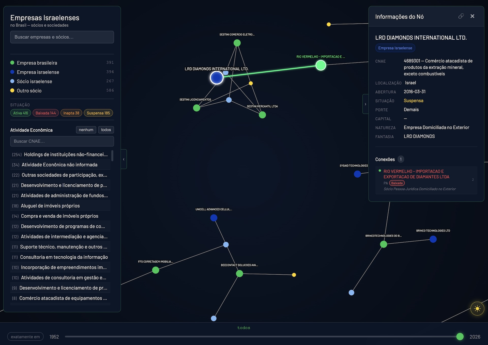

# shutafut — שׁוּתָפוּת

> *shutafut* (שׁוּתָפוּת) — parceria, sociedade empresarial em hebraico
---

Visualização interativa da rede de empresas e sócios israelenses no brasil, com base nos dados públicos do CNPJ federal.

<div align="center">
    
</div>

→ [Navegar](https://rafapolo.github.io/shutafut)

---

## Stats

| Category                                  | Count |
|------------------------------------------|------:|
| Sócios brasileiros (pessoas físicas)     |   586 |
| Sócios israelenses (pessoas físicas)     |   267 |
| Empresas brasileiras                     |   391 |
| Empresas israelenses                    |   394 |

## Top Atividades Econômicas

| # | CNAE     | Atividade                                           | Empresas | %     |
|--:|----------|-----------------------------------------------------|--------:|------:|
| 1 | 6462000  | Holdings de instituições não-financeiras            |      44 | 11.3% |
| 2 | 6810202  | Aluguel de imóveis próprios                         |      17 | 4.3%  |
| 3 | 6203100  | Desenvolvimento e licenciamento de software         |      17 | 4.3%  |
| 4 | 6810201  | Compra e venda de imóveis próprios                  |      12 | 3.1%  |
| 5 | 7020400  | Consultoria em gestão empresarial                   |      10 | 2.6%  |

## O que mostra

| Nó | Cor | Descrição |
|----|-----|-----------|
| Empresa israelense | Azul escuro | Estabelecimentos com país de origem Israel (`pais = 383`) no cadastro da Receita Federal |
| Empresa brasileira | Verde | Empresas brasileiras com ao menos um sócio israelense |
| Sócio israelense | Azul claro | Pessoas físicas ou jurídicas com nacionalidade israelense |
| Outro sócio | Amarelo | Demais sócios das empresas acima |

Arestas representam vínculos societários. Empresas registradas como sócias de outras empresas aparecem como nós de empresa (sem duplicação).

## Filtros disponíveis

| Filtro | Descrição |
|--------|-----------|
| Tipo de nó | Oculta/exibe cada categoria pela legenda |
| Situação | Filtra por situação cadastral (Ativa, Baixada, Inapta, Suspensa) |
| CNAE | Filtra por atividade econômica principal |
| Ano | Mostra empresas fundadas até um ano, ou exatamente naquele ano |

Clique em qualquer nó para ver detalhes, conexões e situação cadastral. A URL reflete o nó selecionado e pode ser compartilhada.

---

## Funcionalidades

 Filtros (painel esquerdo)
  - Busca por nome de nó (empresa/pessoa) com botão limpar
  - Filtro de situação da empresa por chips coloridos: Ativa, Baixada, Inapta, Suspensa
  - Filtro de CNAE (atividade econômica) com busca por texto, "nenhum" e "todos"

  Timeline de ano (barra inferior)
  - Slider "até ano X" — mostra empresas fundadas até aquele ano
  - Botão de modo exato "em ano X" — mostra só empresas fundadas naquele ano
  - Exibe "todos" quando no máximo

  Grafo
  - Clique em nó abre painel direito com detalhes (nome, UF, CNAE, situação, sócios)
  - Botão copiar deeplink do nó (?node=...)
  - Link de nó via URL carrega o grafo já focado naquele nó
  - Filtro de legenda por tipo (pessoa física, empresa, empresa israelense, etc.)
  - Botão "destacar arestas" (☀) aumenta opacidade das conexões

  Layout / painéis
  - Painel esquerdo colapsável (tab ‹)
  - Painel direito (info do nó) colapsável (tab ›)
  - Resize drag nas bordas dos painéis
  - No mobile: botão ⚙ abre/fecha painel esquerdo como overlay

---

## Rodar localmente

```bash
bun install   # instala dependências (apenas para geração de dados)
bunx serve .  # ou qualquer servidor HTTP estático
```

Abrir `http://localhost:3000` no navegador.

## Gerar os dados

O script `generate.js` lê um banco DuckDB local com os dados públicos da Receita Federal e gera `output/network_israel.json`.

```bash
bun generate.js
```

Requer o banco `../empresas/empresas.duckdb` com as tabelas `companies.estabelecimentos`, `companies.socios`, `companies.empresas`, `companies.cnaes`, `companies.municipios` e `companies.naturezas_juridica`.

Os dados públicos do CNPJ estão disponíveis em [dados.gov.br](https://dados.gov.br/dados/conjuntos-dados/cadastro-nacional-da-pessoa-juridica---cnpj).

---

## Fontes

- Cadastro Nacional de Pessoas Jurídicas (CNPJ) — Receita Federal do Brasil
- Código de país `383` identifica Israel no padrão ISO adotado pela Receita
- Dados atualizados em Abril de 2026
